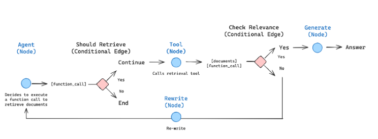
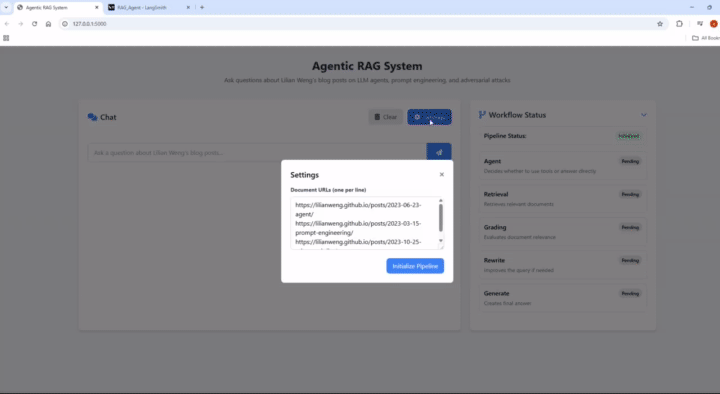

# Agentic RAG System

An advanced Retrieval-Augmented Generation (RAG) system with agentic capabilities, built with LangChain and Flask.


## Features

- **Agentic RAG Pipeline**: Uses LangGraph to create a workflow that intelligently processes queries
- **Document Relevance Grading**: Evaluates retrieved documents for relevance to the query
- **Query Rewriting**: Improves queries when initial retrieval isn't successful
- **Web UI**: Clean, responsive interface for interacting with the RAG system
- **Debug Mode**: Visualize each step of the RAG workflow
- **Customizable Sources**: Configure your own document sources

## Architecture

The system implements a sophisticated RAG workflow:

1. **Agent Node**: Decides whether to use tools or answer directly
2. **Retrieval Node**: Fetches relevant documents using vector search
3. **Grading Node**: Evaluates retrieved documents for relevance
4. **Rewrite Node**: Reformulates queries for better retrieval when needed
5. **Generate Node**: Creates comprehensive answers based on retrieved information

## Requirements

- Python 3.8+
- OpenAI API key
- LangSmith API key (optional, for tracing)

## Installation

1. Clone this repository:

2. Install the required packages:
```bash
pip install -r requirements.txt
```

3. Create a `.env` file in the root directory with your API keys:
```
OPENAI_API_KEY=your_openai_api_key
LANGSMITH_API_KEY=your_langsmith_api_key
```

## Usage

1. Start the application:
```bash
python app.py
```

2. Open your browser and navigate to `http://localhost:5000`

3. Ask questions about Lilian Weng's blog posts on LLM agents, prompt engineering, and adversarial attacks

4. Customize document sources in the Settings panel

## Results

[Complete video](https://drive.google.com/file/d/1gjWiFM34iMMiSN6iHydbZri9QNpP1tLD/view?usp=sharing)

## Project Structure

```
agentic_rag/
│
├── app.py                   # Main application entry point
├── requirements.txt         # Project dependencies
│
├── core/                    # Core functionality
│   ├── config.py            # Configuration settings
│   ├── state.py             # State definitions
│   └── utils.py             # Utility functions
│
├── components/              # Component implementations
│   ├── document_loader.py   # Document loading logic
│   ├── embeddings.py        # Embedding functionality
│   ├── vectorstore.py       # Vector database operations
│   └── retriever.py         # Retriever tool implementation
│
├── nodes/                   # Workflow nodes
│   ├── agent_node.py        # Agent decision node
│   ├── retrieval_node.py    # Document retrieval node
│   ├── rewrite_node.py      # Query rewriting node
│   ├── generate_node.py     # Answer generation node
│   └── grade_node.py        # Document relevance evaluation
│
├── graph/                   # Graph implementation
│   └── workflow.py          # Graph definition and implementation
│
├── static/                  # Static assets
│   ├── css/
│   │   └── style.css        # Custom styles
│   └── js/
│       └── main.js          # Frontend JavaScript
│
└── templates/               # HTML templates
    └── index.html           # Main UI template
```

## Customization

You can customize the system by modifying:

- `core/config.py`: Change model configurations and defaults
- `components/retriever.py`: Modify retrieval behavior
- `nodes/`: Adjust individual workflow nodes
- `templates/index.html`: Customize the UI

## Credits

This project builds upon the [LangChain](https://github.com/langchain-ai/langchain) and [LangGraph](https://github.com/langchain-ai/langgraph) frameworks.