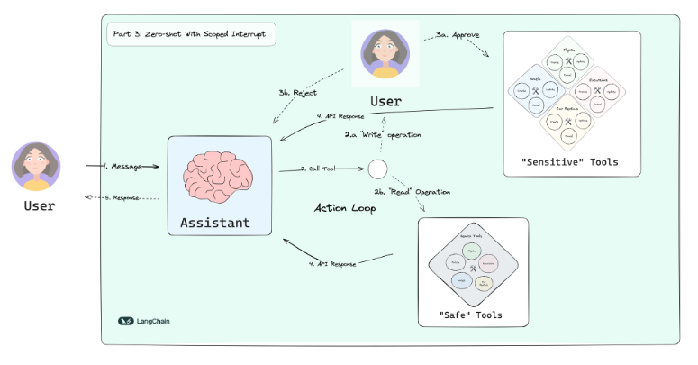

# Swiss Airlines Travel Assistant

✈️ A conversational AI assistant for managing flight bookings, hotels, car rentals, and travel recommendations with human-in-the-loop approval for sensitive operations.



## Features

- **Flight Management**: Check, change, or cancel flight bookings
- **Hotel Booking**: Search for and book hotels at your destination
- **Car Rentals**: Find and book car rentals
- **Travel Recommendations**: Get personalized recommendations for excursions
- **Human-in-the-Loop**: Approval workflow for sensitive operations
- **Policy Lookup**: Check airline policies before making changes

## Architecture

The application is built using a clean, modular architecture:

- **LangGraph**: For orchestrating the conversation flow
- **Claude AI**: Powering the conversational assistant
- **Streamlit**: Web UI for interaction
- **SQLite**: Local database for flight, hotel, and car rental information

## Getting Started

### Prerequisites

- Python 3.9+
- API keys for:
  - Anthropic (Claude)
  - OpenAI (for embeddings)
  - Tavily (for search)

### Installation

1. Clone this repository:

```bash
git clone https://github.com/your-username/travel-assistant.git
cd travel-assistant
```

2. Install dependencies:

```bash
pip install -r requirements.txt
```

3. Create a local database:
```bash
python setup.py
```

4. Add your API keys in .env file:

```
ANTHROPIC_API_KEY=your_api_key
OPENAI_API_KEY=your_api_key
TAVILY_API_KEY=your_api_key
```

### Running the Application

There are several ways to run the application:

1. Using the run.py script (recommended):

```bash
python run.py
```

2. Directly with Streamlit:

```bash
streamlit run ui/app.py
```

3. Using the main.py entry point:

```bash
python main.py
```

If you encounter import errors, ensure that:
- All requirements are installed
- You're running from the project root directory
- The project structure is set up correctly

## Project Structure

```
travel_assistant/
├── README.md                 # Project documentation
├── requirements.txt          # Dependencies
├── main.py                   # Entry point for the application
├── config.py                 # Configuration and environment settings
├── database/                 # Database handling
├── tools/                    # Tool implementations
├── assistant/                # Assistant implementation
└── ui/                       # Streamlit UI
```

## Human-in-the-Loop Workflow

The application includes a human-in-the-loop workflow for sensitive operations:

1. User requests a change (e.g., booking a hotel)
2. Assistant prepares the operation
3. System halts and asks for user approval
4. User can approve or reject with feedback
5. Assistant continues based on user decision

## Results

[Complete video](https://drive.google.com/drive/folders/1OVG9blaXnn4D4HvntLfc-QW4R7lrKAwC?usp=sharing)